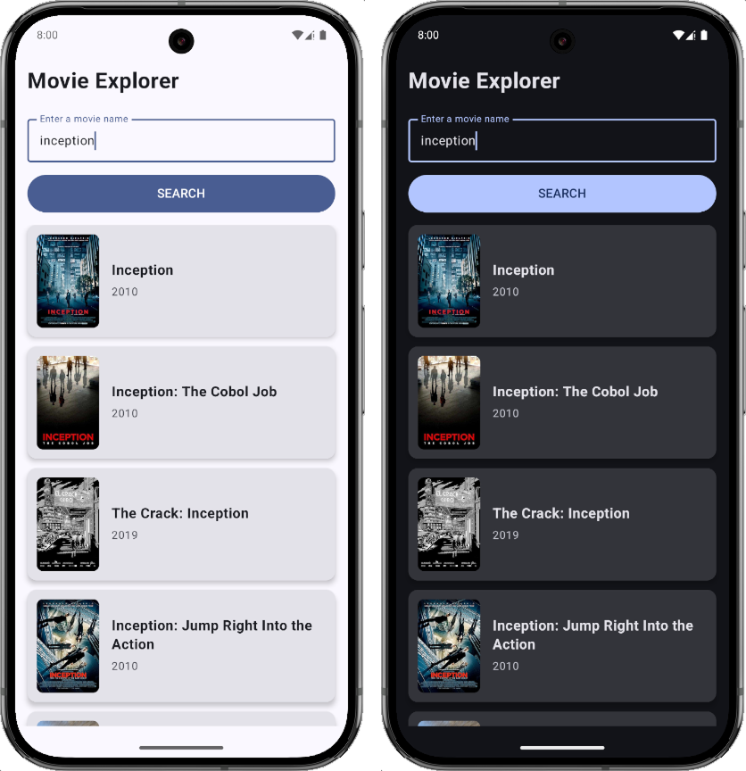

# Movie Explorer

A minimal Android app built with Jetpack Compose that lets users search for movies via the OMDb API.

## Features

- Search for movies by title
- Displays title, year, and poster thumbnail
- Handles network and API errors gracefully
- UI states for loading, error, and empty results
- ViewModel unit tested using JUnit, MockK, and Turbine
- Dependency Injection using Koin

## UI Design

- Text input for entering movie names
- "Search" button to trigger movie search
- Scrollable list of results showing:
    - Movie Title
    - Release Year
    - Poster Thumbnail

## API

Using OMDb API: https://www.omdbapi.com/